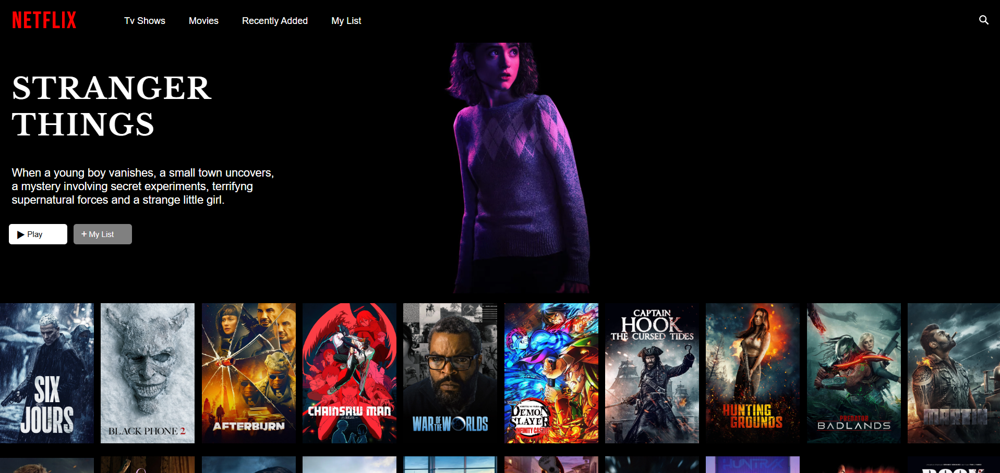

# Netflix Clone 

Un clone di Netflix realizzato con React e TypeScript, che utilizza l'API di TMDB per mostrare film e serie TV.




##  Tecnologie utilizzate
- React
- TypeScript
- The Movie Database API (TMDB)

##  Installazione

1. Clona il repository:
```
git clone https://github.com/aiSoSa3005/netflix-clone.git
cd netflix-clone
```

2. Installa le dipendenze:
```
npm install
```

3. Crea un file `.env` nella root del progetto con il seguente contenuto:
```
VITE_TMDB_API_KEY=la_tua_chiave_api_tmdb
```

4. Avvia il progetto:
```
npm run dev
```

5. Accedi a [http://localhost:5173](http://localhost:5173) per visualizzare l'app.

##  Note
- Per ottenere una chiave API di TMDB, registrati su [https://www.themoviedb.org/](https://www.themoviedb.org/).
- Senza la chiave API, l'app non potrà recuperare i dati dei film e delle serie.

##  Dipendenze principali
- React
- Axios (per le chiamate HTTP)
- TMDB API
- TypeScript
- Vite (per l'ambiente di sviluppo)

##  Stato del progetto
Progetto work-in-progress. Alcune funzionalità sono ancora da implementare.


